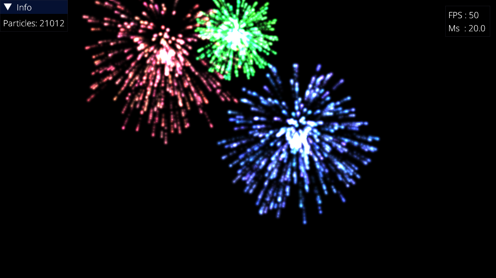

# lightweightvk_screenshot_tests

Reference screenshots and comparison tools for [LightweightVK](https://github.com/corporateshark/lightweightvk) CI screenshot tests.

## Structure

```
references/
  001_HelloTriangle.png
  002_RenderToCubeMap.png
  003_RenderToCubeMapSinglePass.png
  004_YUV.png
  005_MeshShaders.png
  008_MeshShaderFireworks.png
  010_OmniShadows.png
  RTX_001_Hello.png
scripts/
  compare_screenshots.py
```

## How it works

The [CI workflow](https://github.com/corporateshark/lightweightvk/blob/master/.github/workflows/c-cpp.yml) runs samples in headless mode at 720p (1280x720) and captures screenshots at specific frame numbers. The `compare_screenshots.py` script then compares rendered images against the references in this repository using per-pixel RMSE with a configurable threshold.

All samples use a deterministic fixed timestep (0.02s) when `--screenshot-frame` is set, ensuring identical output across runs regardless of actual frame timing.

### Tested samples

| Sample | Frame | Notes |
|--------|-------|-------|
| 001_HelloTriangle | 1 | Static scene |
| 002_RenderToCubeMap | 42 | Rotating cube mapped with per-face colored triangles |
| 003_RenderToCubeMapSinglePass | 83 | Same scene as 002 (single-pass), different rotation angle |
| 004_YUV | 1 | YUV texture decoding (NV12/420p) |
| 005_MeshShaders | 1 | Static scene |
| 008_MeshShaderFireworks | 1930 | Deterministic particle simulation with isolated RNG |
| 010_OmniShadows | 42 | Animated point light casting omnidirectional shadows |
| RTX_001_Hello | 83 | Ray-traced rotating icosahedron |

Samples requiring assets from `deploy_content.py` (007_DynamicRenderingLocalRead, 009_TriplanarMapping) are excluded.



## Comparison script

`scripts/compare_screenshots.py` is a pure Python tool (no external dependencies) that reads/writes PNG using `struct`/`zlib`.

```bash
python3 scripts/compare_screenshots.py <rendered_dir> <reference_dir> --threshold 1.0 --diff-dir diffs
```

- `--threshold` — maximum allowed RMSE per image (0-255 scale)
- `--diff-dir` — optional directory for difference visualization PNGs

## Updating reference images

1. Run the CI workflow (or run samples locally with `--width 1280 --height 720 --screenshot-frame <N>`)
2. Download the `LogsAndScreenshots` artifact
3. Copy the rendered PNGs into `references/`
4. Commit and push to this repository
5. Update the `revision` hash in `third-party/bootstrap-deps.json` in the [main repo](https://github.com/corporateshark/lightweightvk)

## Conditional download

This repository is cloned by default. To disable, configure [LightweightVK](https://github.com/corporateshark/lightweightvk) with `-DLVK_DEPLOY_SCREENSHOT_TESTS=OFF`.
